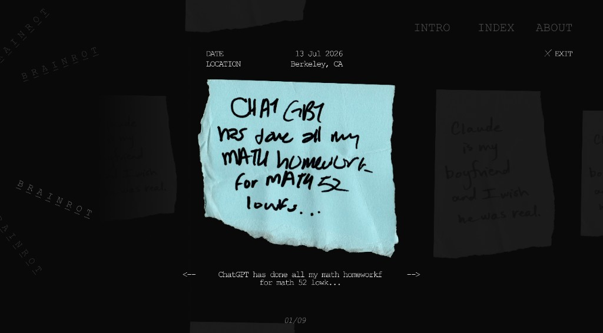
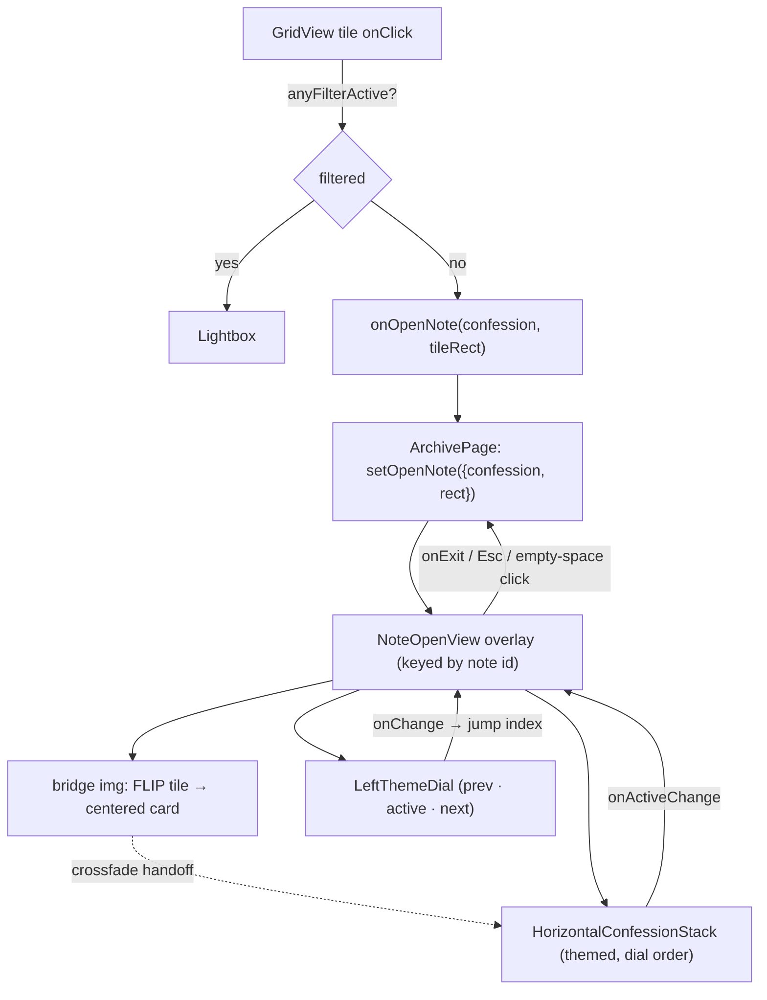

# Note-Open View — Product Design Spec / Handoff

The full-screen view a visitor lands on when they **click a note in the GRID with no filter applied**. It reuses the **DIAL page's horizontal side-scrolling note stack** (`HorizontalConfessionStack`): the active note is centered, its neighbours tilt away in a coverflow and are degraded to grain + B&W, and **dark edge gradients** fade the far left/right into black as the notes slide. The active note carries its own Date / Location + transcript. A left-edge **theme dial** (theme name, note count, description) sits over a near-black gradient backdrop, with `INTRO · INDEX · ABOUT` and `✕ EXIT` top-right.

On open, the **clicked grid image itself flies + scales from its tile into the centered card** (a shared-element morph), then crossfades to the real stack card as the dial + chrome wash in. After that, scrolling (or clicking a neighbour) moves through all themed notes in dial order and **auto-rotates the left dial** to the current note's category; clicking a category on the dial **jumps** the stack to that category's first note.

**On mobile (`≤ 760px`)** the horizontal coverflow has no room for side neighbours, so the stack rotates 90° into a **vertical carousel** (`VerticalConfessionStack`): the active note is centered, the **previous note peeks from the top edge and the next from the bottom**, and the visitor **swipes up / down** (native vertical scroll-snap) to move between them. The rotary dial is hidden; the theme name + description move to a top-left caption and the `NN/MM` note counter to the bottom-center. The entrance morph is skipped (straight reveal). Everything else — grain / B&W neighbour degradation, `NoteMeta`, transcript, black backdrop — carries over.



- **Figma:** `AI CONFESSIONS RAW — SOCIAL`, node `250-145`
- **View component:** `src/NoteOpenView.jsx` (`NoteOpenView` + local `LeftThemeDial` [desktop] + `MobileThemeCaption` [mobile]); a `useIsMobile()` media hook (`≤ 760px`) picks the layout
- **Reused as-is:** `HorizontalConfessionStack` (desktop) / `VerticalConfessionStack` (mobile) — both in `src/SideDial.jsx`, sharing the inactive-card grain/B&W filter, per-note `NoteMeta` date/location + transcript, and note sizing; `TunableGrainBackground` + shared `NOISE_GRADIENT` (`src/NoiseGradient.jsx`); theme palette + `themeStats` / `sortConfessionsByEmotions` (`src/themes.js`)
- **Entry wiring:** `GridView` → `ArchivePage` (`src/App.jsx`) — the clicked tile's `getBoundingClientRect()` is passed through as the morph origin
- **Motion lib:** `motion/react` (Framer Motion v12); the entrance morph uses the imperative `useAnimate` on a bridge ``. The stack owns the scroll / coverflow; the surrounding chrome + left dial fade / slide in after the morph lands.

The choreography follows Emil Kowalski's rules (entrances = `ease-out`; only `transform` / `opacity` / `filter:blur` animate; every motion has a `prefers-reduced-motion` fallback).

---

## 1. Trigger

`GridView` already tracks whether any filter is live:

```js
const anyFilterActive =
  !!q || selectedCats.size > 0 || selectedLocs.size > 0 || sortOrder != null;
```

| Condition on tile click | Result |
|---|---|
| `!anyFilterActive` | **Open this view** (`onOpenNote(confession, tileRect)`) |
| `anyFilterActive` | Existing `Lightbox` (unchanged) |

The clicked confession + the tile's `getBoundingClientRect()` are handed to `NoteOpenView`, which seeds the stack's active index to that note (so it opens centered on it) and uses the rect as the **origin box for the shared-element morph** (§B).

Rationale: filtered browsing is a "search / compare" task where the lightweight lightbox is faster; the unfiltered grid is the "wander the archive" path where the immersive side-scrolling view pays off.

---

## 2. Easing

| Name | Cubic bézier | Use |
|---|---|---|
| `EASE_OUT` | `[0.165, 0.84, 0.44, 1]` | the tile→center morph, bridge crossfade, left-dial slide-in, chrome fade |
| `GRADIENT_EASE` | `[0.22, 1, 0.36, 1]` (ease-out-quint) | active-wordmark crossfade (dial) |

The stack's own coverflow / scroll-snap / mount-stagger easings live in `HorizontalConfessionStack` (`src/SideDial.jsx`). Exit fades the whole overlay out (`0.3s`). Nothing uses `ease-in`.

---

## 3. Entrance storyboard

Two phases. **Phase 1 is the morph** — the clicked grid image flies + scales from its tile to the centered card while everything else is hidden. **Phase 2** crossfades to the real stack card and washes in the dial + chrome. The reveal is *gated on the morph finishing* (a promise, not a fixed timer), so a slow image just delays the reveal — the cascade never races ahead of the note.

```
 ─────────────────────────────────────────────────────────────
 PHASE 1 — MORPH   (t = 0 at grid tile click)
 ─────────────────────────────────────────────────────────────
    0ms   backdrop is opaque INSTANTLY (black gradient + grain) — the grid, and
          the clicked tile's hover→rest animation, is hidden at once: no ghost /
          double-image behind the lifting note
          · a bridge , wearing the SAME paper-warp + grain filter as the
            grid tiles, is parked exactly over the clicked image's pixels
            (tile rect, inset by its 42px padding, letterboxed to aspect) from
            the first frame — so the note reads as lifting off its own tile
          · stack is mounted but opacity 0 (laid out so it can be measured)
          · once the stack's active card has scrolled to centre AND stopped
            drifting, the FLIP target locks and the bridge travels + scales to it
            (MORPH_S 0.52s, EASE_OUT)
  ~520ms  bridge lands on the centred card → phase = 'done'
 ─────────────────────────────────────────────────────────────
 PHASE 2 — REVEAL   (t = 0 at "done")
 ─────────────────────────────────────────────────────────────
    0ms   · stack crossfades in (opacity 0→1) while the bridge fades out
            (BRIDGE_FADE_S 0.3s) — a matched-box handoff to the real card
    0ms   · left theme dial fades + slides in (prev · active · next, N NOTES, desc)
   +40ms  · top-right chrome fades in (INTRO · INDEX · ABOUT · ✕ EXIT)
 ─────────────────────────────────────────────────────────────
```

The active card's Date / Location + word-stagger transcript are owned by the stack (`NoteMeta` / `TranscriptReveal`) and reveal with the card. After entry, the stack's own choreography re-runs on note / category change — the hero swaps and neighbours re-tilt as it scrolls (no morph).

---

## 4. Anatomy

| Zone | Contents |
|---|---|
| Top-right chrome | `INTRO · INDEX · ABOUT` links, with `✕ EXIT` beneath (returns to grid) |
| Left column | **Theme dial** — `prev` category (top) · **active** (large) · `next` (bottom), clickable; `N NOTES` count; placeholder description |
| Center | **Horizontal note stack** (`HorizontalConfessionStack`) — active note centered + emphasized; scroll / drag / click to move through all themed notes in dial order |
| Sides | Coverflow **neighbour notes** tilting away (`rotateY` + `translateZ`), degraded to `blur + grayscale(1) + grain` (the dial's inactive-card filter) |
| Edges | **Dark edge gradients** — `linear-gradient(to right, …)` darkening the far left/right so notes dissolve into black as they slide |
| On active card | Date / Location row (`NoteMeta`) above; word-stagger **transcript** (`TranscriptReveal`) below — owned by the stack |
| Background | **Black gradient** — shared `NOISE_GRADIENT` (charcoal `#161515` centre → pure-black `#010000` edges, same as landing/onboarding) + film grain. Monochrome; no category tint |

---

## 5. States & components

### A. Backdrop — black gradient + grain + edge gradients
Full-screen black gradient (the site's shared `NOISE_GRADIENT`) on `st.root`. The charcoal centre subtly lifts the centered note; the edges fall to pure black, reinforced by the dark edge gradients so the sliding neighbours dissolve into black. Monochrome — no category tint.

When a **morph** is running the backdrop is **opaque from frame 0** (root mounts at full opacity, no fade) so the grid — and the clicked tile's hover→rest animation — is hidden instantly; the lifting note is the only thing over black. Without a morph (reduced motion / mobile / no origin rect) the overlay still fades in over `0.3s`.

| Property | Value |
|---|---|
| Base | `NOISE_GRADIENT` on root (`#010000` fallback): `radial-gradient(ellipse 100% 85% at 50% 40%, #161515 0%, #0B0A0A 45%, #040303 78%, #010000 100%)` |
| Grain | `TunableGrainBackground` (shared site texture), `st.backdrop` (z 0) |
| Edge gradients | `linear-gradient(to right, rgba(0,0,0,0.92) 0%, 0.6 7%, 0 22% … 0 78%, 0.6 93%, 0.92 100%)`, `st.edgeVignette` (z 5, `pointer-events:none`) — the dial page's edge vignette |

### B. Note stack — `HorizontalConfessionStack` (reused from the dial page)
The note carousel is the exact component the DIAL page uses, fed the **themed** confessions sorted into dial order. It owns the scroll, coverflow tilt, active-card emphasis, inactive-card grain/B&W filter, and the per-note `NoteMeta` + transcript.

| Property | Value |
|---|---|
| Data | `confessions.filter(c => c.category)` → `sortConfessionsByEmotions(…, emotions)` (clustered in dial order) |
| Active index | seeded to the clicked note; `onActiveChange` (scroll / click) updates it → drives the left dial |
| Coverflow | inactive cards `rotateY` + `translateZ` away from center (written from JS on scroll); active card scales ~1.12 |
| Inactive filter | `blur(4px) grayscale(1) url(#card-noise)` (animated turbulence/displacement grain) — the shared "Inactive Cards" DialKit panel |
| Active card | full colour + sharp; `NoteMeta` (date / location) above, word-stagger `TranscriptReveal` below |
| Scroll-to-active | external `activeIndex` changes (dial click, `←` / `→`) smooth-scroll the stack to center that note |

**Shared-element bridge (entrance only).** A single bridge `` (`src` = the clicked image) does the morph, then hands off to this stack:

| Property | Value |
|---|---|
| Look | the bridge wears the **same paper-warp + grain** the grid tiles use — its own `NoiseDisplaceFilter` id (`#note-open-bridge-noise`, so it can't collide with GridView's copy). So the lifted image is pixel-identical to the note the visitor clicked, not a clean copy that pops on lift-off |
| Start box | the clicked grid image's visible pixels — `originRect` inset by `TILE_PADDING` (42px), then `containBox()`-letterboxed to the image's natural aspect. The bridge is **parked here from the first frame** (before the target is known), over the already-opaque backdrop, so the note reads as lifting off its own tile with no black gap |
| Target box | the centered active-card `` rect — locked only **after the stack's active card has both reached centre (≤40px of viewport centre) and stopped drifting (≤2px across two frames)**. The stack keeps moving for several frames after mount (instant initial scroll, coverflow ~1.12 scale, image-load width settle); measuring too early sent the bridge to a stale, off-centre card and it popped ~140px sideways onto the real one at hand-off |
| Morph | `useAnimate` → `x / y / scaleX / scaleY` from start→target, `MORPH_S`, `EASE_OUT`, `transform-origin: 0 0` |
| Handoff | on completion → `phase = 'done'`: stack crossfades in (opacity) while the bridge fades out over `BRIDGE_FADE_S`, then unmounts — the bridge and the real card now share the exact same box, so there's no shift |
| Guards | only when `originRect` + `confession.image` + the note is in the stack (`seedIndex ≥ 0`); if the target can't be measured / settled within ~2s (120 frames) it FLIPs to the latest reading, and if no target at all it falls back to a plain reveal. During the morph the stack's `mountEntrance` is off (no wave stagger competing with the bridge) |

### C. Left theme dial — `LeftThemeDial`
The theme's identity block pinned to the left. **prev (top) · active (large) · next (bottom)** category names; clicking a neighbour jumps the stack to that category. Auto-rotates as you scroll the stack across category boundaries.

| Element | Property | Value |
|---|---|---|
| Active label | centered, emphasized (crossfades on change) | `#ededed`, ~30px, weight 600, serif |
| Neighbour labels | prev above / next below, click to switch | `rgba(255,255,255,0.3)`, ~15px |
| Count | `NN NOTES` (notes in active category) | mono, `rgba(190,190,190,~0.75)` |
| Description | placeholder theme blurb (from `THEME_META`) | serif body, `rgba(229,229,229,0.66)`, max ~250px |
| Entrance | fade + slide in from left | `opacity 0 → 1`, `x -12 → 0`, **0.5s**, `EASE_OUT`, delay `0.12s` |

### D. Category switch + scroll sync
The dial and the stack stay in lock-step, both driven by the stack's `activeIndex`:

```
 DIAL CLICK (prev / next category)
    → find first themed note of that category → set activeIndex
    → stack smooth-scrolls to center it; hero swaps + neighbours re-tilt
    → active wordmark + "N NOTES" + description crossfade   (GRADIENT_EASE)

 STACK SCROLL / CARD CLICK
    → onActiveChange(index) → activeIndex updates
    → active note's category derives the left dial's active label (auto-rotate)
```

Count = `themeStats(confessions, label).count` — always "within this theme".

### E. Chrome

| Element | Behaviour |
|---|---|
| `✕ EXIT` | `onExit()` → returns to grid; also bound to `Esc` |
| **Empty-space click** | Clicking **any blank area** of the overlay (the black backdrop, the gaps around/above/below the notes, the dial's empty column) also `onExit()`s back to the grid — a "tap-out to dismiss" affordance. A single bubbling `onClick` on the overlay root runs it only when the click did **not** land on a note card or an interactive control: `e.target.closest('[data-card],[data-vcard],button,a')` short-circuits it. So neighbour-card taps still navigate, and the dial / nav / EXIT buttons keep their own handlers. Gated on the entrance having landed (`revealed`) so a stray click mid-morph can't bounce the visitor straight out |
| `INTRO` / `INDEX` / `ABOUT` | muted top-right links (ABOUT opens the existing About panel; INTRO/INDEX are placeholders); fades in on entrance |
| `←` / `→` keys | step the active note within the stack (wraps); the stack smooth-scrolls to it |

Navigation is by scroll / drag / neighbour-click — no on-screen arrows. The active note's position **within its category** shows as an `n / total` counter pinned to the **bottom-center of the screen** (mono, dimmed total; hidden for single-note categories). It updates live as you move between notes and mirrors the left dial's `NOTES` sub-label. To leave, click `✕ EXIT`, press `Esc`, or **click any empty space**.

> The counter is rendered by the overlay (`NoteOpenView`), not the stack: `HorizontalConfessionStack` takes a `showInlineCounter` prop (default `true` for the theme page, where the counter still rides under the transcript). The note-open view passes `showInlineCounter={false}` and draws its own copy at the screen bottom instead. Mobile uses the `MobileThemeCaption` counter (see §5.F).

### F. Mobile — vertical carousel (`VerticalConfessionStack`, `≤ 760px`)
On phone-width viewports the note goes near full-width, leaving no room for the horizontal coverflow's side neighbours or the left rotary dial. The stack is therefore rotated to a **vertical scroll-snap carousel**, and the dial collapses to a lightweight caption.

| Aspect | Behaviour |
|---|---|
| Layout | Active note **centered**; previous note **peeks from the top**, next from the **bottom** (both dimmed + grained). The active image (not the whole card) is centered, so Date/Location sits in the gap above and the transcript in the gap below |
| Navigation | Native vertical **scroll-snap** (`scroll-snap-type: y proximity`) — swipe up/down; the centered note is detected on scroll (rAF-throttled) → `onActiveChange`. Tapping a peeking neighbour jumps to it. No infinite loop (a flat list is enough for touch) |
| Neighbour peek | `V_INACTIVE_OPACITY` `{ near 0.46, far 0.14 }` — brighter than the horizontal strip's `0.18/0.07` so the peek reads against pure black. Same `blur + grayscale(1) + grain` filter |
| Edge gradients | Top/bottom vignette (`edgeVignetteV`) instead of left/right — a **short outer-5% fade** so it dissolves the extreme lip without swallowing the peek |
| Theme context | Rotary dial **hidden**. `MobileThemeCaption` shows the category name + description **top-left** and the `NN/MM` counter **bottom-center**; both crossfade as the centered note's category/position change |
| Entrance | Morph **skipped** (`wantMorph` gated on `!isMobile`) — the notes just fade/stagger in. Overlay fade respects reduced motion |

Peek size is set by `V_STACK_GAP` (bigger gap ⇒ smaller peek); ≈120px peek on a full-height phone.

---

## 6. Data-model additions — `src/themes.js`

`THEME_META` gains a placeholder `description` per theme, and a small helper counts notes per category:

```js
// Monochrome: every theme shares one neutral grey glow (colour tints removed).
const NEUTRAL_GRADIENT = radial('#2a2a2a');

export const THEME_META = {
  Therapist: { id: 'therapist', gradient: NEUTRAL_GRADIENT,
    description: 'Placeholder — what people confide when the AI becomes the therapist.' },
  // …one line per theme
};

/** Notes in a category (for the dial's "N NOTES" label). */
export function themeStats(confessions, label) {
  return { count: confessions.filter((c) => c.category === label).length };
}
```

No change to `loadConfessions` — description is UI copy, not sheet data.

---

## 7. Reduced motion

`useReducedMotion()` is respected throughout:
- **No morph.** `phase` starts `'done'`; the clicked note simply *is* centered, no bridge image.
- Overlay + chrome + left dial appear at final opacity / position (no fade / slide).
- The stack mounts with `mountEntrance={false}` — cards appear in place, no wave stagger (and the stack drops its coverflow / scroll animations internally under reduced motion).
- `NoteMeta` + transcript render in full immediately (no word-stagger).
- Wordmark crossfades become instant swaps.

Verified via `Emulation.setEmulatedMedia({ prefers-reduced-motion: reduce })`: opening a note paints the full layout with no animation.

---

## 8. Wiring map



| File | Change |
|---|---|
| `src/themes.js` | `description` per `THEME_META`; `themeStats()` helper |
| `src/NoteOpenView.jsx` | `NoteOpenView` + local `LeftThemeDial` + `MobileThemeCaption`; `useIsMobile()` switches between **`HorizontalConfessionStack`** (desktop) and **`VerticalConfessionStack`** (mobile), both from `src/SideDial.jsx` |
| `src/SideDial.jsx` | adds **`VerticalConfessionStack`** — mobile vertical scroll-snap carousel (prev/next peek top/bottom), reusing the stack's filter / `NoteMeta` / transcript |
| `src/App.jsx` — `GridView` | tile `onClick` passes `onOpenNote(c, rect)` when `!anyFilterActive`, else `Lightbox` |
| `src/App.jsx` — `ArchivePage` | `openNote = {confession, rect}` state; render `<NoteOpenView key={id}>` in an `AnimatePresence` overlay |

---

## 9. Tunable constants (in `NoteOpenView.jsx`)

```js
const EASE_OUT = [0.165, 0.84, 0.44, 1];   // morph, crossfade, dial + chrome reveal
const GRADIENT_EASE = [0.22, 1, 0.36, 1];   // dial active-wordmark crossfade

const MORPH_S = 0.52;      // s — clicked grid image → centered card (FLIP)
const BRIDGE_FADE_S = 0.3; // s — crossfade bridge out / real stack card in
const TILE_PADDING = 42;   // px — grid tile img padding (see GridView); used to
                           //      start the bridge on the real image pixels
const BRIDGE_FILTER_ID = 'note-open-bridge-noise'; // bridge's own copy of the
                           //      grid's paper-warp + grain (NoiseDisplaceFilter)
const MOBILE_MQ = '(max-width: 760px)'; // ≤ this → VerticalConfessionStack + caption
```

Mobile carousel constants live in `src/SideDial.jsx` (top of the vertical-stack block):

```js
const V_STACK_GAP = 118;         // px between stacked notes; bigger ⇒ smaller peek
const V_STACK_PAD_VH = 31;       // vh headroom so first/last can center
const V_INACTIVE_OPACITY = { near: 0.46, far: 0.14 }; // peeking-neighbour opacity
```

The top/bottom `edgeVignetteV` fade lives in `NoteOpenView.jsx`'s `st`.

Everything about the note carousel itself — coverflow warp, scroll-snap, mount stagger, card sizing, the inactive-card grain/B&W filter, and the film grain — lives in `HorizontalConfessionStack` (`src/SideDial.jsx`) and its **"Inactive Cards"** + **"Grain"** DialKit panels (`?dial=1`), shared with the DIAL page. Tune once, both views update.
